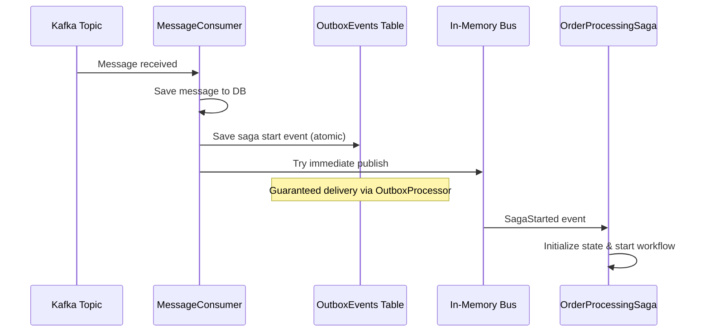
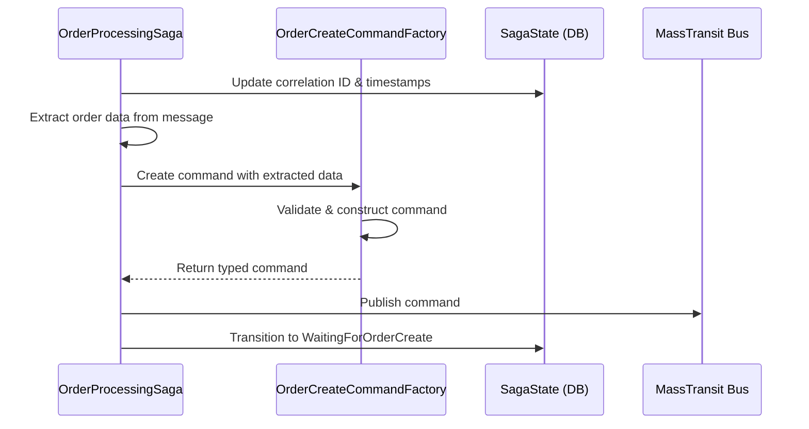
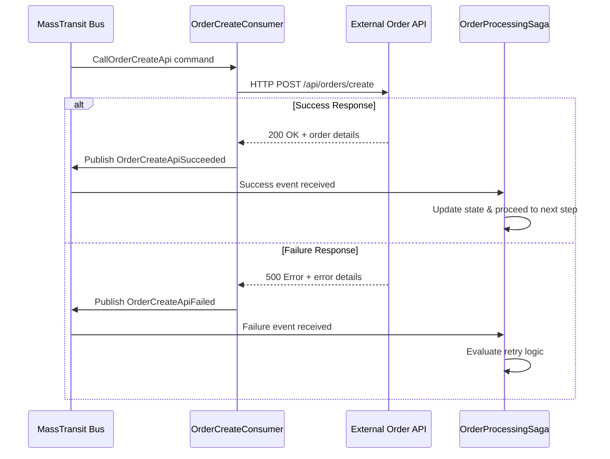
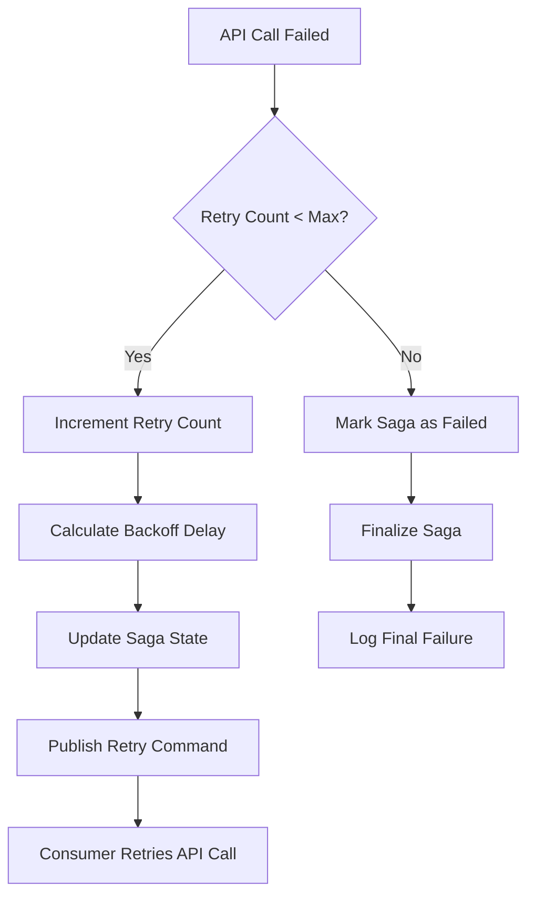
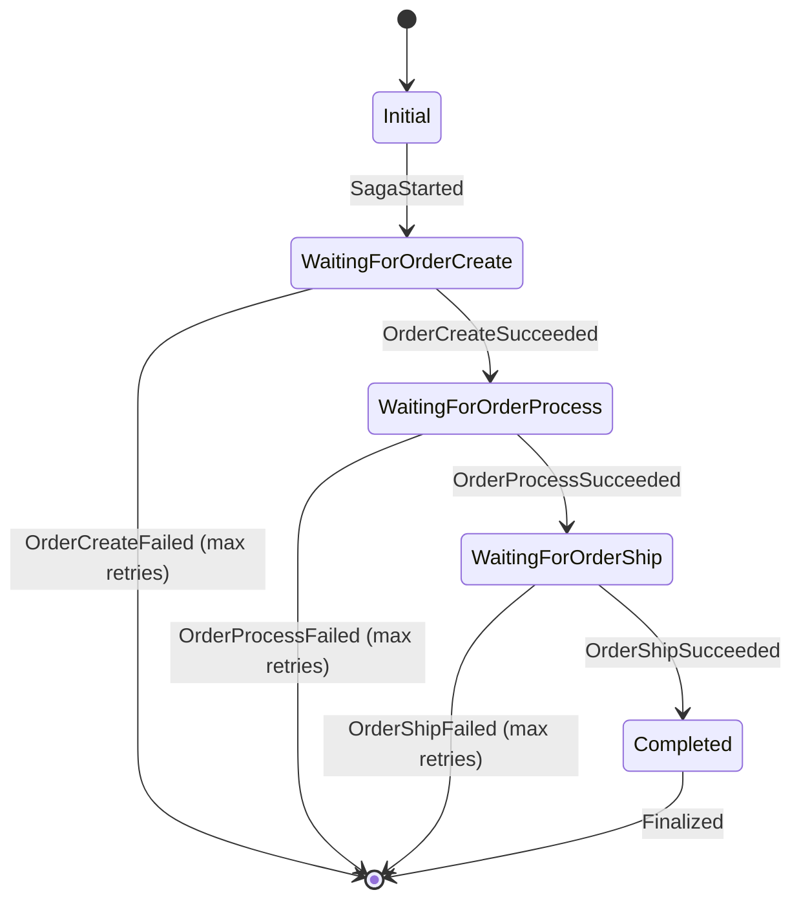

# 🏗️ Saga Architecture & Data Flow Guide

## 📖 Overview

This document explains **WHY** each component exists in our saga framework, **HOW** data flows through the system, and **WHEN** to use specific patterns. It complements the [Onboarding Guide](ONBOARDING_NEW_SAGA.md) by providing the architectural reasoning behind each step.

## 🎯 Target Audience

- Developers implementing new sagas
- Architects reviewing the framework design
- Teams wanting to understand distributed saga patterns
- Anyone debugging saga workflows

---

## 🔄 Data Flow Journey

### **1. Message Reception → Saga Initiation**



**🤔 WHY this pattern?**

- **Atomic Persistence**: Message and saga start event saved together - prevents message loss
- **Guaranteed Delivery**: OutboxProcessor ensures saga starts even if immediate publish fails
- **Idempotency**: Using `message.Id` as correlation ID prevents duplicate sagas
- **Reliability**: System survives crashes between message receipt and saga start

**📊 Data Transformation:**
```json
// Input: Kafka Message
{
  "id": "order-123",
  "stepData": {
    "order-created": { "customerId": "C001", "amount": 99.99 },
    "order-processed": { "processType": "standard" },
    "order-shipped": { "address": "123 Main St" }
  }
}

// Output: Saga Start Event  
{
  "correlationId": "order-123",  // ← CRITICAL: Uses message.Id for idempotency
  "originalMessage": { /* full message */ },
  "startedAt": "2023-12-01T10:00:00Z"
}
```

---

### **2. Saga State Management → Command Creation**



**🤔 WHY Factory Interface Pattern?**

- **Type Safety**: Compile-time validation prevents runtime command creation errors
- **Testability**: Easy to mock factories for unit tests
- **Explicit Dependencies**: Clear what each saga needs to create commands
- **Performance**: Direct object construction (no reflection overhead)
- **Maintainability**: Easy to modify command structure without breaking framework

**📊 Data Transformation:**
```csharp
// Input: Message StepData extraction
var orderData = message.StepData["order-created"]; 
// → { "customerId": "C001", "amount": 99.99 }

// Factory creates strongly-typed command
var command = _createFactory.Create(
    correlationId: sagaId,
    data: orderData,
    retryCount: 0
);

// Output: Typed Command
CallOrderCreateApi {
    CorrelationId = "order-123",
    OrderData = { "customerId": "C001", "amount": 99.99 },
    RetryCount = 0
}
```

---

### **3. External API Interaction → Response Handling**



**🤔 WHY separate API consumers?**

- **Separation of Concerns**: Saga handles orchestration, consumers handle HTTP details
- **Timeout Management**: Each consumer can have specific timeout settings
- **Error Transformation**: Convert HTTP errors to domain events
- **Retry Logic**: Independent retry configuration per API
- **Monitoring**: Separate metrics and logging per external service

**📊 Error Handling Flow:**
```csharp
// Consumer transforms HTTP failure to domain event
try {
    var response = await httpClient.PostAsync(url, content);
    if (response.IsSuccessStatusCode) {
        // Success path
        await context.Publish(new OrderCreateApiSucceeded {
            CorrelationId = command.CorrelationId,
            Response = await response.Content.ReadAsStringAsync()
        });
    } else {
        // HTTP error path
        await context.Publish(new OrderCreateApiFailed {
            CorrelationId = command.CorrelationId,
            Error = $"HTTP {response.StatusCode}: {response.ReasonPhrase}",
            RetryCount = command.RetryCount
        });
    }
} catch (Exception ex) {
    // Network/timeout error path
    await context.Publish(new OrderCreateApiFailed {
        CorrelationId = command.CorrelationId,
        Error = ex.Message,
        RetryCount = command.RetryCount
    });
}
```

---

### **4. Retry Logic → Decision Making**



**🤔 WHY this retry pattern?**

- **Resilience**: Handles transient network issues and temporary service unavailability
- **Exponential Backoff**: Prevents overwhelming failing services
- **State Persistence**: Retry counts survive application restarts
- **Bounded Retries**: Prevents infinite retry loops
- **Audit Trail**: Complete history of retry attempts

**📊 Retry Decision Logic:**
```csharp
// Saga evaluates whether to retry
.IfElse(context => ShouldRetryStep(context.Saga.OrderCreateRetryCount, maxRetries: 3),
    // Retry path
    retry => retry
        .Then(context => {
            context.Saga.OrderCreateRetryCount = context.Message.RetryCount + 1;
            context.Saga.LastError = context.Message.Error;
            context.Saga.LastUpdated = DateTime.UtcNow;
        })
        .PublishAsync(context => context.Init<CallOrderCreateApi>(
            _createFactory.Create(
                context.Saga.CorrelationId, 
                ExtractOrderData(context.Saga.OriginalMessage!), 
                context.Message.RetryCount + 1  // ← Incremented retry count
            )
        )),
    // Give up path
    fail => fail.Finalize()
)

// Helper method
private static bool ShouldRetryStep(int currentRetryCount, int maxRetries) 
    => currentRetryCount < maxRetries;
```

---

### **5. Sequential Step Progression → Workflow Completion**



**🤔 WHY sequential processing?**

- **Business Logic**: Order must be created before processing, processed before shipping
- **Data Dependencies**: Each step may use data from previous steps
- **Failure Isolation**: If order creation fails, don't attempt processing
- **Resource Efficiency**: Don't reserve shipping resources if order will fail
- **Audit Trail**: Clear progression through business workflow

**📊 State Transitions:**
```csharp
// Each step extracts relevant data and progresses workflow
During(WaitingForOrderCreate,
    When(OrderCreateSucceeded)
        .Then(context => {
            // Update state with success data
            context.Saga.OrderCreatedApiCalled = true;
            context.Saga.OrderCreateResponse = context.Message.Response;
            context.Saga.LastUpdated = DateTime.UtcNow;
        })
        // Extract DIFFERENT data for next step
        .PublishAsync(context => context.Init<CallOrderProcessApi>(
            _processFactory.Create(
                context.Saga.CorrelationId, 
                ExtractProcessData(context.Saga.OriginalMessage!)  // ← Different data extraction
            )
        ))
        .TransitionTo(WaitingForOrderProcess)  // ← State progression
);
```

---

## 🏗️ Architectural Components Deep Dive

### **Why Each Component Exists**

#### **1. Domain Constants**
```csharp
public static class OrderDomainConstants
{
    public static class StepKeys
    {
        public const string OrderCreated = "order-created";
        public const string OrderProcessed = "order-processed"; 
        public const string OrderShipped = "order-shipped";
    }
}
```

**🎯 Purpose:**
- **Consistency**: Single source of truth for message keys
- **Refactoring Safety**: Change key in one place, updates everywhere
- **Domain Isolation**: Each domain owns its constants
- **Documentation**: Self-documenting key names

#### **2. Saga State**
```csharp
public class OrderProcessingSagaState : SagaStateMachineInstance
{
    public Guid CorrelationId { get; set; }  // ← Primary key for saga instance
    public string CurrentState { get; set; } // ← MassTransit state tracking
    
    // Step-specific tracking
    public int OrderCreateRetryCount { get; set; }     // ← Retry persistence
    public bool OrderCreatedApiCalled { get; set; }    // ← Completion tracking
    public string? OrderCreateResponse { get; set; }   // ← Response storage
    
    // Audit and debugging
    public DateTime StartedAt { get; set; }            // ← Workflow timing
    public DateTime? LastUpdated { get; set; }         // ← Activity tracking
    public string? LastError { get; set; }             // ← Error debugging
}
```

**🎯 Purpose:**
- **Persistence**: Saga survives application restarts
- **Correlation**: Links related events across time
- **Retry State**: Remembers retry attempts across restarts
- **Audit Trail**: Complete history for debugging and compliance
- **Progress Tracking**: Know what steps completed successfully

#### **3. Command Factories**
```csharp
public class OrderCreateCommandFactory : ICommandFactory<CallOrderCreateApi, object>
{
    public CallOrderCreateApi Create(Guid correlationId, object data, int retryCount = 0)
    {
        return new CallOrderCreateApi
        {
            CorrelationId = correlationId,
            OrderData = data,
            RetryCount = retryCount
        };
    }
}
```

**🎯 Purpose:**
- **Type Safety**: Compile-time validation of command creation
- **Testability**: Easy to mock for unit tests
- **Consistency**: Standardized command creation across all sagas
- **Performance**: Direct object creation (no reflection)
- **Maintainability**: Easy to modify command structure

#### **4. API Consumers**
```csharp
public class CallOrderCreateApiConsumer : IConsumer<CallOrderCreateApi>
{
    public async Task Consume(ConsumeContext<CallOrderCreateApi> context)
    {
        // HTTP call logic here
    }
}
```

**🎯 Purpose:**
- **Separation of Concerns**: Saga orchestrates, consumer handles HTTP
- **Timeout Management**: Independent timeout settings per API
- **Error Handling**: Transform HTTP errors to domain events
- **Monitoring**: Separate metrics per external service
- **Scalability**: Can scale consumers independently of sagas

---

## 🔍 Common Questions & Architectural Decisions

### **Q: Why not call APIs directly from the saga?**

**A: Separation of Concerns & Testability**
```csharp
// ❌ BAD: Direct API calls in saga
public class OrderProcessingSaga : MassTransitStateMachine<OrderProcessingSagaState>
{
    public async Task CallOrderApi(BehaviorContext<OrderProcessingSagaState> context)
    {
        var httpClient = new HttpClient(); // ← Hard to test
        var response = await httpClient.PostAsync(...); // ← Couples saga to HTTP
    }
}

// ✅ GOOD: Message-driven API calls
.PublishAsync(context => context.Init<CallOrderCreateApi>(...))
// ← Consumer handles HTTP, saga handles orchestration
```

**Benefits:**
- **Testability**: Mock consumers instead of HTTP clients
- **Timeout Isolation**: Different timeouts per API without affecting saga
- **Error Transformation**: HTTP errors become domain events
- **Scalability**: Scale API consumers independently

### **Q: Why extract different data for each step?**

**A: Business Logic & Data Relevance**
```csharp
// Different steps need different data
private static object ExtractOrderData(Message message)
{
    return message.StepData["order-created"];  
    // ← Contains: customerId, items, total
}

private static object ExtractProcessData(Message message)  
{
    return message.StepData["order-processed"];
    // ← Contains: paymentMethod, processingType
}

private static object ExtractShipData(Message message)
{
    return message.StepData["order-shipped"];
    // ← Contains: shippingAddress, carrierPreference
}
```

**Benefits:**
- **Data Relevance**: Each API gets only the data it needs
- **Security**: Sensitive data doesn't go to irrelevant services
- **Performance**: Smaller payloads for better network efficiency
- **API Design**: External APIs can have focused, clean contracts

### **Q: Why persist original message in saga state?**

**A: Data Availability & Debugging**
```csharp
public class OrderProcessingSagaState
{
    public Message? OriginalMessage { get; set; }  // ← Why persist this?
}
```

**Benefits:**
- **Retry Data**: Need original data for retry attempts
- **Data Consistency**: Ensure all steps use same source data
- **Debugging**: Can see exactly what message started the saga
- **Audit Trail**: Complete record for compliance
- **Recovery**: Can replay saga with original data if needed

### **Q: Why use correlation IDs instead of saga instance IDs?**

**A: External System Integration & Idempotency**
```csharp
// Using message.Id as correlation ID
var sagaCorrelationId = message.Id;  // ← NOT Guid.NewGuid()
```

**Benefits:**
- **Idempotency**: Same message always creates same saga
- **External Tracking**: External systems can track saga progress
- **Duplicate Prevention**: Database constraint prevents duplicate sagas
- **Debugging**: Easy to trace from original message to saga instance

---

## 🚀 Best Practices & Guidelines

### **1. Data Extraction Patterns**

```csharp
// ✅ GOOD: Defensive data extraction
private static object ExtractOrderData(Message message)
{
    return message.StepData.TryGetValue("order-created", out var orderData)
        ? orderData
        : new { }; // ← Default empty object prevents null reference
}

// ❌ BAD: Unsafe data extraction  
private static object ExtractOrderData(Message message)
{
    return message.StepData["order-created"]; // ← Throws if key missing
}
```

### **2. Error Message Standards**

```csharp
// ✅ GOOD: Structured error information
await context.Publish(new OrderCreateApiFailed
{
    CorrelationId = command.CorrelationId,
    Error = $"HTTP {response.StatusCode}: {response.ReasonPhrase}", // ← Structured
    RetryCount = command.RetryCount
});

// ❌ BAD: Generic error information
await context.Publish(new OrderCreateApiFailed
{
    Error = "Failed" // ← Not helpful for debugging
});
```

### **3. State Update Patterns**

```csharp
// ✅ GOOD: Complete state updates
.Then(context => {
    context.Saga.OrderCreatedApiCalled = true;        // ← Success flag
    context.Saga.OrderCreateResponse = context.Message.Response; // ← Response data
    context.Saga.LastUpdated = DateTime.UtcNow;       // ← Audit timestamp
})

// ❌ BAD: Incomplete state updates
.Then(context => {
    context.Saga.OrderCreatedApiCalled = true; // ← Missing response and timestamp
})
```

---

## 🔧 Debugging & Troubleshooting

### **Common Issues & Solutions**

#### **1. Saga Not Starting**
```sql
-- Check if message received
SELECT * FROM Messages WHERE Id = 'your-message-id';

-- Check if outbox event created
SELECT * FROM OutboxEvents WHERE EventType LIKE '%SagaStarted%';

-- Check if saga state created
SELECT * FROM OrderProcessingSagaStates WHERE CorrelationId = 'your-correlation-id';
```

#### **2. Saga Stuck in State**
```sql
-- Check current saga state
SELECT CurrentState, LastUpdated, LastError 
FROM OrderProcessingSagaStates 
WHERE CorrelationId = 'your-correlation-id';

-- Check pending outbox events
SELECT * FROM OutboxEvents 
WHERE NOT Processed 
AND Data LIKE '%your-correlation-id%';
```

#### **3. API Calls Not Happening**
- Check consumer registration in DI
- Verify command factory registration
- Check MassTransit bus configuration
- Review consumer error logs

---

## 📈 Performance Considerations

### **1. Database Queries**

```csharp
// ✅ OPTIMIZED: Query specific saga by correlation ID
var saga = await context.SagaRepository.Get(correlationId);

// ❌ SLOW: Query all sagas then filter
var allSagas = await context.SagaRepository.GetAll();
var saga = allSagas.FirstOrDefault(s => s.CorrelationId == correlationId);
```

### **2. Message Size**

```csharp
// ✅ GOOD: Store large data in message, small references in commands
public record CallOrderCreateApi
{
    public Guid CorrelationId { get; init; }
    public object OrderData { get; init; }  // ← Only relevant data
    public int RetryCount { get; init; }
}

// ❌ BAD: Include entire original message in every command
public record CallOrderCreateApi  
{
    public Message OriginalMessage { get; init; }  // ← Unnecessary data transfer
}
```

### **3. Outbox Processing**

```csharp
// Batch size affects performance vs latency tradeoff
private readonly int _batchSize = 100; // ← Configurable based on load

var pendingEvents = await dbContext.OutboxEvents
    .Where(e => !e.Processed && e.ScheduledFor <= DateTime.UtcNow)
    .Take(_batchSize) // ← Process in batches for efficiency
    .ToListAsync();
```

---

**🎯 This guide provides the "why" behind every architectural decision, helping developers understand not just how to implement sagas, but why the framework is designed this way. Use this alongside the [Onboarding Guide](ONBOARDING_NEW_SAGA.md) for complete understanding.**
